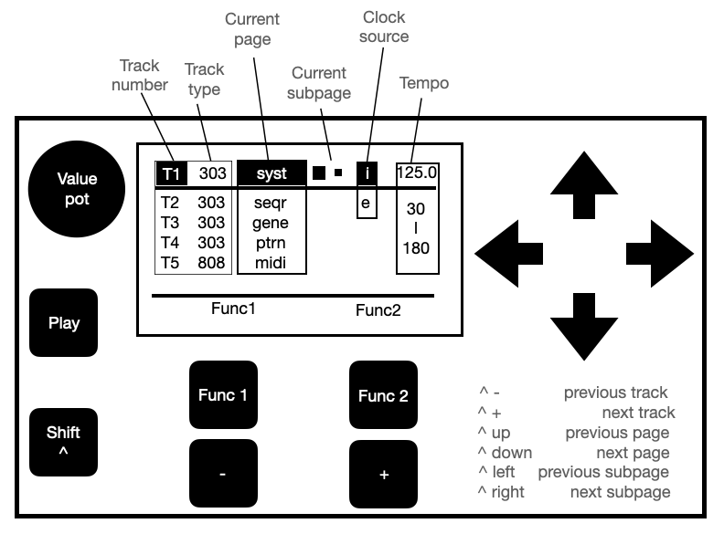
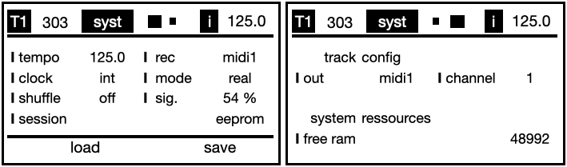
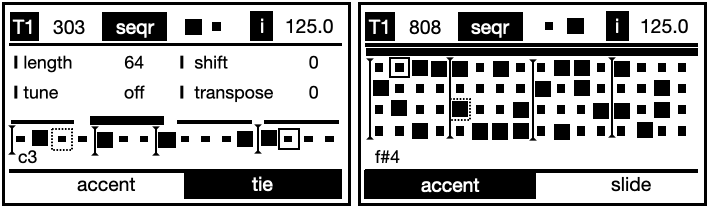
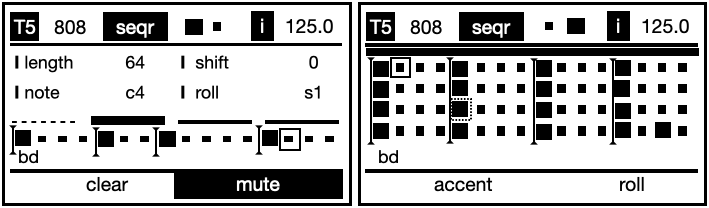
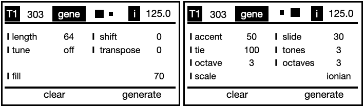
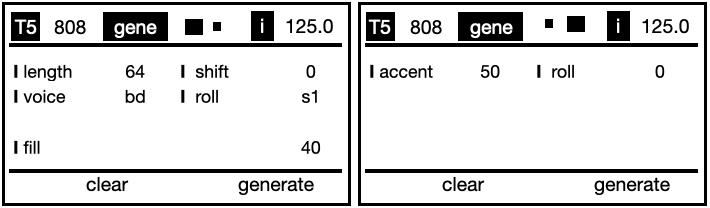
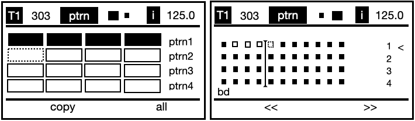
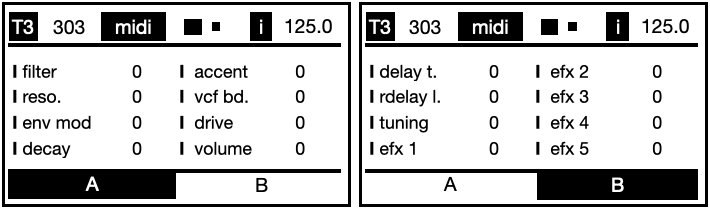
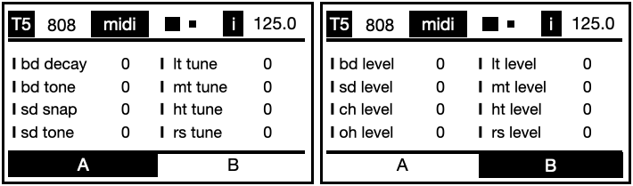

# ACIDUINO V2 User Manual

## Introduction

Up to 16 Tracks TB303/TR808 sequencer with step, pattern and mute automation grid system, MIDI Controller, OLED display and extensible modular design to plug more potentiometers, buttons, MIDI or CV/Gate interfaces.

A friend of mine some time ago had come out with this one:
"Put your DIY super powers to the test building your own Roland’s TB-303 and TB-808 step sequencer! An Arduino based clone project specially hacked with corrosive features for live performances! Save your money building this classic sequencer clone faster than a blink of an eye."

## GETTING STARTED

To use aciduino, follow these steps:

1. Read the documentation [here](https://github.com/midilab/aciduino/tree/master/v2/)
2. Build your device [following these steps](https://github.com/midilab/aciduino/tree/master/v2#assembly)
3. Download the latest [software](https://github.com/midilab/aciduino/releases)
4. Check your hardware configuration in `/AciduinoV2/0_hardware_setup.ino`
5. Ajust the sequencer to your taste in `/AciduinoV2/src/sequencer/setup.h`

## USER INTERFACE
If you followed the assembly guide you should have a device like this :

The interface presents you simple schema to navigate and interact with you aciduino.

- **Navigation buttons:** UP, DOWN, LEFT. RIGTH. use to navigate thru page elements. The current selected element is blinking.  
*4 right most buttons*  
- **Function buttons:** If the current selected element has an action, it will show up at bottom of your display with the action name for each button.  
*2 upper buttons*  
- **Generic buttons:** Acts as value changer, a decrementer and incrementer for almost all elements.  
*2 lower buttons*  
- **Pot:** Acts as a value changer just like generic buttons, most of elements can be changed using generic buttons or the pot as wish.  
- **Shift button** Hold it while press another interface button.  
*bottom left button*  
- **Transport button** press to start or stop the sequencer  
*middle left button*  

The GUI is divided into the following main sections:

- **Header bar:** Contains the Track number (by default T1 to T5) and type (303 or 808), the Page name and selected subpage (1 or 2), the clock soucre and tempo value (40-180).
- **Subpage display:** where the actual tweaking occurs.
- **Function buttons label:** Provides a clear feedback for the 2 function buttons

## WORKFLOW

The Workflow consists of 5 pages :  
**System** : common parameters to all tracks  
**Sequencer** : the place to edit the Track sequence  
**Generator** : where the magic happens  
**Pattern** : performance page, mute or unmute tracks or drum voices, save and load patterns
**Midi** : tweak your 16 favourite CCs  

*Shift + Nav UP/DOWN:* Change page  
*Shift + Nav LEFT/RIGHT:* Changes subpage  
*Shift + Generic button 1:* Previous track  
*Shift + Generic button 2:* Next track  

 ### **System Page** 
The system Page is common to all tracks

**Tempo** set uClock tempo from 40 to 180  
*pot=coarse adjust  
F1=rec / F2=play  
generic buttons=fine adjust*  

**clock:** choose clock source, internal, midi1 or midi2  
*pot=coarse adjust  
No function available  
generic buttons= decrementer / incrementer*  

**shuffle:** turn the groove on or off  
*pot=on/off  
No function available  
generic buttons=on/off*  

**sig.:** set the swing signature (3 MPC signatures, user signatures can be added)
*pot=54, 58, 62, 68, 71%  
No function available  
generic buttons= decrementer / incrementer*  

**rec:** input source midi1 or midi2  
*pot=select source  
No function available  
generic buttons= decrementer / incrementer*  

**mode:** record in real time or step mode  
*pot=real/step  
No function available  
generic buttons= decrementer / incrementer*  

**session:** save your ideas on eeprom or SDCard  
*pot=storage  
F1=load / F2=save  
generic buttons= decrementer / incrementer*  

**Track Config:**  
**out :** midi 1 or midi 2
 
  
*pot=storage  
F1=load / F2=save  
generic buttons= decrementer / incrementer*  

---  

### Sequencer page     
 There are slightly different parameters depending on the Track type.
 
  **length:**  define the number of steps in the current sequence 
  0 to whatever you defined in `/AciduinoV2/src/sequencer/setup.h`for a 303 track.  
 0 to 64 for a 808 track. Note that each drum voice of a 808 track can have a different pattern length   
*pot=step number  
No function available   
generic buttons= decrementer / incrementer* 

 **Shift :** offset the whole sequence forward or backward  
 
  - **303 Sequencer Page**  
   
  **Tune:** set the tonic note (off - C1 -> B1)  
   *pot=off/set tonic note  
   No function available   
   generic buttons= decrementer / incrementer*   
     
  **transpose :** transpose the sequence   
  *pot=off/set tonic note  
No function available    
generic buttons= decrementer / incrementer*  
  
  **Bar Selector :** the bar above the step sequencer representation. Each division represent a 16 step bar, a bold division tells which bar is being played, a blinking division tells which bar is being edited    
  *pot=no option  
F1=clear sequence / F2=mute pattern   
generic buttons= bugs the sequence*  

  **Step Selector :** each small square is a rest,each bold square is a gated step. The label underneath the sequencer is indicating the step note and octave. The blinking step outline tells which bar is being edited. When Aciduino is playing, the moving step outline is indicating which step is being played.  
     Default note velocity is 70, accented is 127. This can be defined in `/AciduinoV2/src/sequencer/setup.h`  
  *pot=select picth  
  shift+pot=select octave      
  F1= accent / F2=slide(gated step) or tie (rest) 
  generic buttons= trigger  / F2=mute pattern*  

  - **808 Sequencer Page**
 
 **Voice:** set the tonic note    
 **Note:** set the drum part midi note number  
 **roll:** set the roll type  
 **Step Sequencer Pot, Shift + Pot**  
808: [Pot] Changes notes [Shift + Pot] Changes Drum Voice  

---

### Generator page  

 **Fill:**  the percentage of activated steps in the sequence, this will only affect the next generated sequence  
  *pot=step number  
No function available  
generic buttons= decrementer / incrementer*  

  - **303 Generator Page**  
    
 
   **Tune:** set the tonic note (off - C1 -> B1)  
  **transpose :** transpose the sequence  
 

 - **808 Generator Page**
   
 808: [Pot] Changes voice [Shift + Pot] Changes voice config(midi cc or cv port) 
 

---  

### Pattern page 

 
  *pot=no interaction here
F1=copy / F2=all
Shift+F1=save as / Shift+F2=save  
generic buttons= play selected pattern / play selected scene*  

--- 

### MIDI page 

 
 
 
  

 - **Midi CCs** they are sent on the selected Track MIDI channel, CC# and naming can be changed in in `/AciduinoV2/page_midi.ino` : look for     `midiControllerComponent.set303Control("filter", 74);`

---

## Support

Check the [official midilab website](https://midilab.co/)  for the latest news

For any inquiries or technical support, please open an [issue](https://github.com/midilab/aciduino/issues)

For some nice talking, ideas or questions you can say hi on our  [discord channel](https://discord.com/channels/1137685010967703582/1137685011416498236)

---
 2023 Aciduino.
